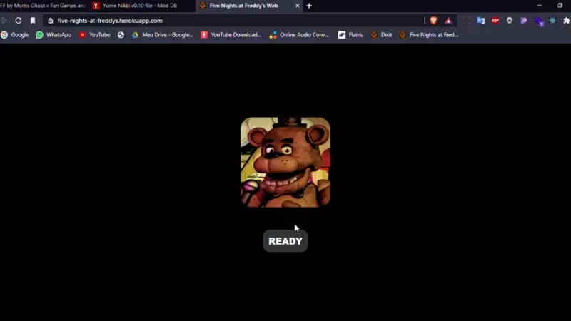

# ~ FNAF 1 Web

A web version I've made of the popular horror game Five Nights at Freddy's. 
⚛️ It was made using popular technologies like [ReactJS](https://pt-br.reactjs.org/) and [Redux](https://redux.js.org/).

## VERSION 3.0 ⭐
- Added custom night!

~ Link: https://teenagerbot.github.io/FNAF-1/



## Installation

First you need to clone this repository

```
git clone https://github.com/teenagerbot/FNAF-1.git
```

Then start it using npm or yarn

```
npm i
```

Then start localhost

```
npm start
```

## Credits

This project was made by Wendell Sousa :D
